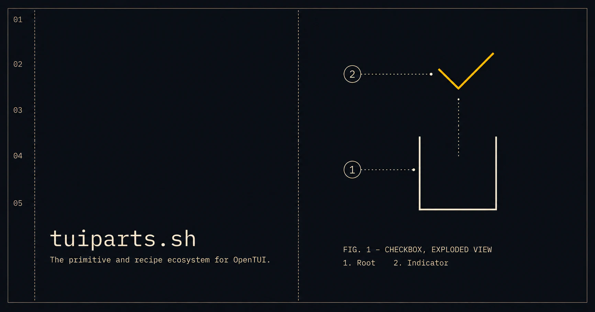

# tuiparts.sh — OpenTUI Primitives and Recipes

Build terminal user interfaces with packaged interaction behavior and editable
source for OpenTUI Core, React, and Solid. Install Recipes with the official
shadcn CLI, then own every presentation decision in your application.



[Browse Recipes](https://tuiparts.sh/docs/catalog/) ·
[Quick start](https://tuiparts.sh/docs/quickstart/) ·
[Explore Primitives](https://tuiparts.sh/docs/primitives/) ·
[Read the documentation](https://tuiparts.sh/docs/)

## Start with a Recipe

Recipes are styled Core, React, or Solid source that you copy into an existing
[OpenTUI](https://github.com/anomalyco/opentui) application. Choose a runtime
and install a Checkbox Recipe:

| Runtime | Command |
| --- | --- |
| Core | `pnpm dlx shadcn@4.13.0 add @tuiparts/core/checkbox` |
| React | `pnpm dlx shadcn@4.13.0 add @tuiparts/react/checkbox` |
| Solid | `pnpm dlx shadcn@4.13.0 add @tuiparts/solid/checkbox` |

The CLI copies the Recipe and its consumer-owned theme into `components/ui`
and installs its package dependencies. There is no shadcn project setup or
hidden styling runtime. Change the installed source when you need a different
layout, glyph, token mapping, or public API.

[See the Checkbox Recipe in use](https://tuiparts.sh/docs/catalog/checkbox/) or
[browse the complete Catalog](https://tuiparts.sh/docs/catalog/).

## Package the difficult behavior. Copy the opinionated layer.

tuiparts.sh separates terminal UI work by ownership:

- **Primitives** package the behavior that is difficult to implement and
  expensive to maintain: state, focus, keyboard and pointer interaction,
  collections, overlays, and lifecycle. They expose independently composable
  public **Parts** such as Root, Indicator, Thumb, Trigger, and Panel.
- **Recipes** assemble those Parts into working controls with editable layout,
  colors, glyphs, labels, variants, and convenience props. The copied source
  belongs to your application.

Most users should start with a Recipe and reshape it into their house style.
Use a Primitive directly when you need its tested behavior without adopting a
Recipe's composition or public API.

> Behavior is packaged. Presentation is yours.

Read [Primitives and Recipes](./docs/primitives-and-recipes.md) for the layer
choice, [the product architecture](./PRIMITIVES_AND_RECIPES.md) for the deeper
model, and [the Primitive contract](./PRIMITIVE_CONTRACT.md) for the public
behavior standard.

## Catalog

The Catalog includes editable Recipes for Accordion, Badge, Button, Checkbox,
Checkbox Group, Collapsible, Dialog, Input, Number Field, Radio Group, Slider,
Switch, Tabs, Textarea, Toggle, and Toggle Group. Every Recipe is available for
Core, React, and Solid.

Interactive Recipes build on packaged Primitives. Badge is Recipe-only because
it has no reusable interaction behavior. Shared colors, glyphs, borders, and
density live in the consumer-owned Theme Recipe.

The [Registry guide](https://tuiparts.sh/docs/registry/) covers installation,
source ownership, and reviewing upstream changes with the standard shadcn
`view`, `diff`, and `add` lifecycle.

## Foundation packages

Core owns the framework-neutral behavior. React and Solid adapt the same Stores
and Renderables to compound-part APIs. The three Foundation packages version
together.

| Package | Purpose |
| --- | --- |
| [`@tuiparts/core`](./packages/core) | Framework-neutral Primitive Stores and Renderables |
| [`@tuiparts/react`](./packages/react) | React compound-part Adapter |
| [`@tuiparts/solid`](./packages/solid) | Solid compound-part Adapter |

To compose Primitives directly, add the Foundation package for your runtime to
an existing OpenTUI application:

```bash
pnpm add @tuiparts/core
```

```bash
pnpm add @tuiparts/react
```

```bash
pnpm add @tuiparts/solid
```

React and Solid install `@tuiparts/core`; the host application owns its OpenTUI
runtime and framework peers. See each package README for exact peer ranges and
usage.

[`@opentui-ui/dialog`](./packages/dialog) and
[`@opentui-ui/toast`](./packages/toast) are independently versioned Companion
products with higher-level APIs outside the Foundation release line.

## Development

The repository uses pnpm and Bun. Versions are pinned in `package.json` and CI.

```bash
pnpm install
pnpm lint
pnpm typecheck
pnpm test
pnpm build
pnpm validate:packages
```

`validate:packages` packs the Foundation and changed Companion packages, runs
publint and Are the Types Wrong, installs the tarballs in a clean consumer,
typechecks every exported subpath, and executes representative runtime imports.

## Release workflow

1. Add changesets for publishable changes.
2. Merge the generated version PR after CI passes.
3. Publish with npm provenance through the release workflow.
4. Validate packed packages in clean consumers before publishing.

## Attribution

tuiparts.sh is an independent project built for OpenTUI. It is not affiliated
with or endorsed by the OpenTUI or shadcn projects.

(Pronounced "too-ee parts.")

## License

MIT
